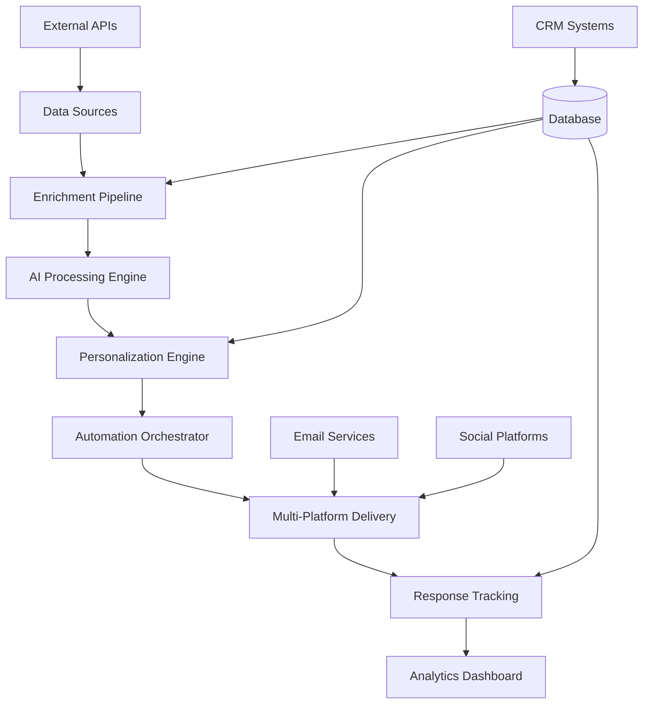

# AI Investor Outreach Platform - Development Plan
**File Path:** `//documents/PLAN_15082025.md`
**Version:** [15-08-2025 14:30:00]
**Authored by:** Sotiris Spyrou, CEO, VerityAI
**Contact:** sotiris@verityai.co | https://www.linkedin.com/in/sspyrou/

---

## 🎯 Project Overview

### Vision Statement
Create an AI-powered platform that revolutionizes investor outreach for startups by combining intelligent data enrichment, personalized messaging, and automated multi-platform engagement to achieve 15-20% response rates.

### Success Metrics
- **Primary KPI:** 10x improvement in response rates (2-3% → 15-20%)
- **Efficiency KPI:** 80% reduction in manual outreach time
- **Commercial KPI:** £100K+ ARR within 12 months
- **User Satisfaction:** 90%+ customer satisfaction score

## 🏗 Technical Architecture

### System Components Flowchart



### Database Schema Overview

```sql
-- Core Tables Structure
investors (id, profile_data, contact_info, preferences)
    ├── investor_enrichment (source_data, content, metadata)
    └── investor_activity (platform, activity_type, timestamp)

campaigns (id, name, config, status, metrics)
    ├── outreach_sequences (investor_id, status, current_step)
    └── messages (platform, content, delivery_status, responses)

analytics (campaign_id, metric_type, value, timestamp)
    └── performance_reports (aggregated_metrics, insights)
```

## 📋 Development Phases

### Phase 1: Foundation Infrastructure (Weeks 1-3)

#### Week 1: Project Setup & Core Infrastructure
**Objectives:**
- Establish development environment
- Implement authentication system
- Create basic database schema
- Set up CI/CD pipeline

**Deliverables:**
```
/project-root
├── /app                    # Next.js 13+ app directory
│   ├── /dashboard         # Main application routes
│   ├── /auth             # Authentication pages
│   └── /api              # API endpoints
├── /components
│   ├── /ui               # Reusable UI components
│   └── /forms            # Form components
├── /lib
│   ├── /database         # Supabase utilities
│   ├── /auth             # Authentication helpers
│   └── /utils            # Common utilities
├── /database
│   ├── schema.sql        # Database schema
│   └── seed.sql          # Sample data
└── /docs                 # Documentation
```

**Technical Tasks:**
```typescript
// 1. Supabase Configuration
// /lib/database/supabase.ts
import { createClient } from '@supabase/supabase-js'

export const supabase = createClient(
  process.env.NEXT_PUBLIC_SUPABASE_URL!,
  process.env.NEXT_PUBLIC_SUPABASE_ANON_KEY!
)

// 2. Authentication Setup
// /lib/auth/auth-provider.tsx
export function AuthProvider({ children }: { children: React.ReactNode }) {
  // Implement Supabase Auth context
}

// 3. Database Schema
-- /database/schema.sql
CREATE TABLE investors (
  id UUID PRIMARY KEY DEFAULT gen_random_uuid(),
  first_name VARCHAR(100) NOT NULL,
  last_name VARCHAR(100) NOT NULL,
  email VARCHAR(255) UNIQUE,
  linkedin_url VARCHAR(500),
  twitter_handle VARCHAR(100),
  company VARCHAR(200),
  title VARCHAR(200),
  investment_stages JSONB,
  sectors JSONB,
  geographies JSONB,
  created_at TIMESTAMP DEFAULT NOW(),
  updated_at TIMESTAMP DEFAULT NOW()
);
```

#### Week 2: Investor Management System
**Objectives:**
- Build investor CRUD operations
- Implement data import functionality
- Create investor profile interface
- Add search and filtering capabilities

**Core Features:**
```typescript
// /app/investors/page.tsx
export default function InvestorsPage() {
  return (
    <div className="space-y-6">
      <InvestorFilters />
      <InvestorTable />
      <ImportInvestorsDialog />
    </div>
  )
}

// /lib/database/investors.ts
export async function createInvestor(data: InvestorData) {
  const { data: investor, error } = await supabase
    .from('investors')
    .insert(data)
    .select()
    .single()
  
  if (error) throw error
  return investor
}

export async function getInvestors(filters: InvestorFilters) {
  let query = supabase.from('investors').select('*')
  
  if (filters.sectors) {
    query = query.contains('sectors', filters.sectors)
  }
  
  if (filters.stages) {
    query = query.contains('investment_stages', filters.stages)
  }
  
  return query
}
```

#### Week 3: Data Enrichment Foundation
**Objectives:**
- Build web scraping framework
- Implement LinkedIn data extraction
- Create X/Twitter data collection
- Set up content processing pipeline

**Technical Implementation:**
```typescript
// /lib/enrichment/linkedin-scraper.ts
export class LinkedInScraper {
  async enrichProfile(linkedinUrl: string): Promise<EnrichmentData> {
    // Implement safe web scraping with rate limiting
    const profile = await this.scrapeProfile(linkedinUrl)
    const posts = await this.scrapeRecentPosts(linkedinUrl)
    
    return {
      profile_data: profile,
      recent_activity: posts,
      last_updated: new Date(),
      confidence_score: this.calculateConfidence(profile, posts)
    }
  }
  
  private async scrapeProfile(url: string) {
    // Implementation with proper error handling and rate limiting
  }
}

// /lib/enrichment/content-processor.ts
export class ContentProcessor {
  async analyzeContent(content: string): Promise<ContentAnalysis> {
    const sentiment = await this.analyzeSentiment(content)
    const topics = await this.extractTopics(content)
    const insights = await this.generateInsights(content)
    
    return { sentiment, topics, insights }
  }
}
```

### Phase 2: AI Integration & Personalization (Weeks 4-6)

#### Week 4: AI Services Integration
**Objectives:**
- Integrate OpenAI/Claude APIs
- Build prompt engineering framework
- Implement content analysis
- Create quality scoring system

**AI Framework:**
```typescript
// /lib/ai/openai-client.ts
export class OpenAIClient {
  private client: OpenAI
  
  constructor() {
    this.client = new OpenAI({
      apiKey: process.env.OPENAI_API_KEY
    })
  }
  
  async generateHook(
    investor: InvestorProfile,
    company: CompanyProfile
  ): Promise<GeneratedHook> {
    const prompt = this.buildPersonalizationPrompt(investor, company)
    
    const completion = await this.client.chat.completions.create({
      model: "gpt-4",
      messages: [{ role: "user", content: prompt }],
      max_tokens: 200,
      temperature: 0.7,
      n: 3 // Generate multiple options
    })
    
    return this.processResponse(completion)
  }
  
  private buildPersonalizationPrompt(
    investor: InvestorProfile,
    company: CompanyProfile
  ): string {
    return `
      Generate a personalized outreach hook for investor outreach.
      
      Investor Profile:
      - Name: ${investor.name}
      - Company: ${investor.company}
      - Recent Activity: ${investor.recent_activity}
      - Investment Focus: ${investor.sectors.join(', ')}
      
      Company Profile:
      - Name: ${company.name}
      - Stage: ${company.stage}
      - Sector: ${company.sector}
      - Value Proposition: ${company.value_prop}
      
      Requirements:
      - Reference specific recent investor activity
      - Connect company value to investor thesis
      - Be authentic and conversational
      - Avoid generic phrases
      - Maximum 100 words
    `
  }
}
```

#### Week 5: Hook Generation Engine
**Objectives:**
- Build personalization algorithms
- Implement A/B testing framework
- Create quality assurance system
- Develop confidence scoring

**Hook Generation System:**
```typescript
// /lib/ai/hook-generator.ts
export class HookGenerator {
  async generatePersonalizedHooks(
    investor: InvestorProfile,
    company: CompanyProfile
  ): Promise<GeneratedHook[]> {
    const enrichedData = await this.enrichInvestorContext(investor)
    const personalizers = await this.identifyPersonalizers(enrichedData)
    
    const hooks = await Promise.all([
      this.generateActivityHook(personalizers.recent_activity, company),
      this.generateThesisHook(personalizers.investment_thesis, company),
      this.generateNetworkHook(personalizers.mutual_connections, company)
    ])
    
    return hooks.map(hook => ({
      ...hook,
      confidence_score: this.calculateConfidence(hook, enrichedData),
      personalization_factors: this.extractFactors(hook, enrichedData)
    }))
  }
  
  private async generateActivityHook(
    activity: InvestorActivity,
    company: CompanyProfile
  ): Promise<GeneratedHook> {
    // Generate hook based on recent investor activity
  }
  
  private calculateConfidence(
    hook: GeneratedHook,
    context: EnrichedContext
  ): number {
    // Score based on:
    // - Specificity of reference
    // - Relevance to investor focus
    // - Quality of connection made
    // - Authenticity of tone
  }
}

// /components/hook-generator.tsx
export function HookGeneratorInterface() {
  const [hooks, setHooks] = useState<GeneratedHook[]>([])
  const [loading, setLoading] = useState(false)
  
  const generateHooks = async () => {
    setLoading(true)
    try {
      const generated = await generatePersonalizedHooks(investor, company)
      setHooks(generated.sort((a, b) => b.confidence_score - a.confidence_score))
    } finally {
      setLoading(false)
    }
  }
  
  return (
    <div className="space-y-4">
      <Button onClick={generateHooks} disabled={loading}>
        {loading ? 'Generating...' : 'Generate Personalized Hooks'}
      </Button>
      
      {hooks.map((hook, index) => (
        <HookCard 
          key={index}
          hook={hook}
          rank={index + 1}
          onSelect={() => selectHook(hook)}
        />
      ))}
    </div>
  )
}
```

#### Week 6: Platform Optimization Engine
**Objectives:**
- Build platform scoring algorithms
- Implement engagement prediction
- Create timing optimization
- Develop success pattern analysis

**Platform Scoring:**
```typescript
// /lib/optimization/platform-scorer.ts
export class PlatformScorer {
  async scoreOptimalPlatform(investor: InvestorProfile): Promise<PlatformScore> {
    const linkedinScore = await this.scoreLinkedInEngagement(investor)
    const twitterScore = await this.scoreTwitterEngagement(investor)
    const emailScore = await this.scoreEmailAccessibility(investor)
    
    return {
      recommended_platform: this.selectBestPlatform(linkedinScore, twitterScore, emailScore),
      platform_scores: {
        linkedin: linkedinScore,
        twitter: twitterScore,
        email: emailScore
      },
      optimal_timing: await this.calculateOptimalTiming(investor),
      confidence: this.calculatePlatformConfidence(investor)
    }
  }
  
  private async scoreLinkedInEngagement(investor: InvestorProfile): Promise<number> {
    const activity = investor.linkedin_activity
    return (
      (activity.post_frequency * 0.3) +
      (activity.engagement_rate * 0.4) +
      (activity.response_history * 0.3)
    )
  }
}
```

### Phase 3: Automation & Integration (Weeks 7-9)

#### Week 7: Outreach Automation Framework
**Objectives:**
- Build campaign management system
- Implement message sequencing
- Create automated sending infrastructure
- Add safety and compliance controls

**Campaign System:**
```typescript
// /lib/automation/campaign-manager.ts
export class CampaignManager {
  async createCampaign(config: CampaignConfig): Promise<Campaign> {
    const campaign = await this.database.campaigns.create({
      name: config.name,
      target_investors: config.targets,
      sequence_config: config.sequence,
      platform_preferences: config.platforms,
      status: 'draft'
    })
    
    // Create individual outreach sequences for each investor
    const sequences = await Promise.all(
      config.targets.map(investor => this.createOutreachSequence(campaign.id, investor))
    )
    
    return { ...campaign, sequences }
  }
  
  async startCampaign(campaignId: string): Promise<void> {
    const campaign = await this.getCampaign(campaignId)
    const sequences = await this.getSequences(campaignId)
    
    // Start with safety checks
    await this.validateCampaignSafety(campaign)
    
    // Begin execution with proper rate limiting
    for (const sequence of sequences) {
      await this.scheduleSequence(sequence)
    }
    
    await this.updateCampaignStatus(campaignId, 'active')
  }
  
  private async createOutreachSequence(
    campaignId: string,
    investor: InvestorProfile
  ): Promise<OutreachSequence> {
    const hooks = await this.generateHooks(investor)
    const platformScore = await this.scorePlatforms(investor)
    
    return {
      campaign_id: campaignId,
      investor_id: investor.id,
      hooks_generated: hooks,
      selected_hook: hooks[0], // Highest confidence
      primary_platform: platformScore.recommended_platform,
      sequence_steps: this.buildSequenceSteps(platformScore),
      status: 'scheduled'
    }
  }
}

// /app/campaigns/[id]/page.tsx
export default function CampaignDetailPage({ params }: { params: { id: string } }) {
  return (
    <div className="space-y-8">
      <CampaignHeader campaignId={params.id} />
      <CampaignMetrics campaignId={params.id} />
      <SequenceList campaignId={params.id} />
      <CampaignControls campaignId={params.id} />
    </div>
  )
}
```

#### Week 8: External Platform Integrations
**Objectives:**
- Integrate LinkedIn automation tools
- Implement X/Twitter automation
- Connect email service providers
- Build CRM synchronization

**Platform Integrations:**
```typescript
// /lib/integrations/linkedin-automation.ts
export class LinkedInAutomation {
  private heyreach: HeyReachClient
  
  async sendConnectionRequest(
    investor: InvestorProfile,
    message: string
  ): Promise<AutomationResult> {
    // Safety checks
    await this.checkDailyLimits()
    await this.validateProfile(investor.linkedin_url)
    
    const result = await this.heyreach.sendConnection({
      profile_url: investor.linkedin_url,
      message: message,
      delay: this.calculateSafeDelay()
    })
    
    // Log for compliance and tracking
    await this.logOutreachActivity({
      investor_id: investor.id,
      platform: 'linkedin',
      action: 'connection_request',
      message: message,
      result: result
    })
    
    return result
  }
  
  async sendMessage(
    investor: InvestorProfile,
    message: string
  ): Promise<AutomationResult> {
    // Check if connection exists
    const isConnected = await this.checkConnection(investor.linkedin_url)
    if (!isConnected) {
      throw new Error('Not connected to investor on LinkedIn')
    }
    
    return this.heyreach.sendMessage({
      profile_url: investor.linkedin_url,
      message: message,
      delay: this.calculateSafeDelay()
    })
  }
  
  private calculateSafeDelay(): number {
    // Implement human-like delays to avoid detection
    return Math.random() * (300000 - 60000) + 60000 // 1-5 minutes
  }
}

// /lib/integrations/email-service.ts
export class EmailService {
  private sendgrid: SendGridAPI
  
  async sendPersonalizedEmail(
    investor: InvestorProfile,
    content: EmailContent
  ): Promise<EmailResult> {
    const email = {
      to: investor.email,
      from: content.from,
      subject: content.subject,
      html: content.html,
      text: content.text,
      tracking_settings: {
        click_tracking: { enable: true },
        open_tracking: { enable: true }
      }
    }
    
    const result = await this.sendgrid.send(email)
    
    await this.logEmailActivity({
      investor_id: investor.id,
      email_id: result.messageId,
      subject: content.subject,
      sent_at: new Date()
    })
    
    return result
  }
}
```

#### Week 9: Advanced Automation Features
**Objectives:**
- Implement response detection
- Build automatic follow-up generation
- Create meeting booking integration
- Add compliance monitoring

**Response Handling:**
```typescript
// /lib/automation/response-handler.ts
export class ResponseHandler {
  async processIncomingResponse(
    platform: Platform,
    messageData: IncomingMessage
  ): Promise<ResponseAction> {
    // Detect and categorize response
    const analysis = await this.analyzeResponse(messageData.content)
    
    // Update sequence status
    await this.updateSequenceStatus(messageData.sequence_id, {
      response_received: true,
      response_sentiment: analysis.sentiment,
      response_content: messageData.content,
      responded_at: new Date()
    })
    
    // Generate appropriate follow-up action
    if (analysis.indicates_interest) {
      return this.generateMeetingBookingResponse(messageData)
    } else if (analysis.indicates_objection) {
      return this.generateObjectionHandlingResponse(messageData, analysis.objection_type)
    } else {
      return this.generateNeutralFollowUp(messageData)
    }
  }
  
  private async analyzeResponse(content: string): Promise<ResponseAnalysis> {
    const analysis = await this.aiClient.analyzeResponse(content)
    
    return {
      sentiment: analysis.sentiment, // positive, neutral, negative
      indicates_interest: analysis.indicates_interest,
      indicates_objection: analysis.indicates_objection,
      objection_type: analysis.objection_type,
      suggests_meeting: analysis.suggests_meeting,
      confidence: analysis.confidence
    }
  }
}
```

### Phase 4: Analytics & Interface (Weeks 10-12)

#### Week 10: Frontend Application Development
**Objectives:**
- Build complete React application
- Implement responsive design
- Create intuitive user workflows
- Add real-time updates

**Main Application Structure:**
```typescript
// /app/layout.tsx
export default function RootLayout({
  children,
}: {
  children: React.ReactNode
}) {
  return (
    <html lang="en">
      <body className={inter.className}>
        <AuthProvider>
          <div className="flex h-screen bg-gray-50">
            <Sidebar />
            <main className="flex-1 overflow-hidden">
              <Header />
              <div className="h-full overflow-auto p-6">
                {children}
              </div>
            </main>
          </div>
        </AuthProvider>
      </body>
    </html>
  )
}

// /app/dashboard/page.tsx
export default function DashboardPage() {
  return (
    <div className="space-y-8">
      <div className="grid grid-cols-1 md:grid-cols-2 lg:grid-cols-4 gap-6">
        <MetricCard title="Active Campaigns" value="12" trend="+2" />
        <MetricCard title="Response Rate" value="18.4%" trend="+3.2%" />
        <MetricCard title="Meetings Booked" value="47" trend="+8" />
        <MetricCard title="Messages Sent" value="1,234" trend="+156" />
      </div>
      
      <div className="grid grid-cols-1 lg:grid-cols-2 gap-8">
        <ResponseRateChart />
        <PlatformPerformanceChart />
      </div>
      
      <RecentActivity />
    </div>
  )
}
```

#### Week 11: Analytics Dashboard
**Objectives:**
- Build comprehensive analytics
- Create performance visualizations
- Implement real-time monitoring
- Add export capabilities

**Analytics Components:**
```typescript
// /components/analytics/response-rate-chart.tsx
export function ResponseRateChart() {
  const { data, loading } = useAnalytics('response-rates', {
    timeframe: '30d',
    granularity: 'daily'
  })
  
  return (
    <Card>
      <CardHeader>
        <CardTitle>Response Rate Trends</CardTitle>
      </CardHeader>
      <CardContent>
        <ResponsiveContainer width="100%" height={300}>
          <LineChart data={data}>
            <CartesianGrid strokeDasharray="3 3" />
            <XAxis dataKey="date" />
            <YAxis />
            <Tooltip />
            <Line 
              type="monotone" 
              dataKey="response_rate" 
              stroke="#8884d8" 
              strokeWidth={2}
            />
          </LineChart>
        </ResponsiveContainer>
      </CardContent>
    </Card>
  )
}

// /lib/analytics/analytics-service.ts
export class AnalyticsService {
  async getCampaignMetrics(campaignId: string): Promise<CampaignMetrics> {
    const metrics = await this.database.query(`
      SELECT 
        COUNT(*) as total_sent,
        COUNT(*) FILTER (WHERE response_received = true) as total_responses,
        COUNT(*) FILTER (WHERE meeting_booked = true) as total_meetings,
        AVG(CASE WHEN response_received THEN 
          EXTRACT(EPOCH FROM (responded_at - sent_at))/3600 
        END) as avg_response_time_hours
      FROM outreach_sequences 
      WHERE campaign_id = $1
    `, [campaignId])
    
    return {
      response_rate: (metrics.total_responses / metrics.total_sent) * 100,
      meeting_booking_rate: (metrics.total_meetings / metrics.total_responses) * 100,
      average_response_time: metrics.avg_response_time_hours,
      total_sent: metrics.total_sent,
      total_responses: metrics.total_responses,
      total_meetings: metrics.total_meetings
    }
  }
}
```

#### Week 12: Testing, Optimization & Deployment
**Objectives:**
- Comprehensive system testing
- Performance optimization
- Security audit
- Production deployment

**Testing Strategy:**
```typescript
// /tests/integration/campaign-flow.test.ts
describe('Campaign Flow Integration', () => {
  test('complete campaign lifecycle', async () => {
    // 1. Create campaign
    const campaign = await createCampaign({
      name: 'Test Campaign',
      targets: testInvestors,
      sequence: defaultSequence
    })
    
    // 2. Generate hooks
    const hooks = await generateHooks(testInvestors[0])
    expect(hooks).toHaveLength(3)
    expect(hooks[0].confidence_score).toBeGreaterThan(0.7)
    
    // 3. Start campaign
    await startCampaign(campaign.id)
    
    // 4. Verify automation
    const sequences = await getSequences(campaign.id)
    expect(sequences.every(s => s.status === 'active')).toBe(true)
    
    // 5. Check metrics
    const metrics = await getCampaignMetrics(campaign.id)
    expect(metrics.total_sent).toBeGreaterThan(0)
  })
})

// /tests/performance/load-test.ts
describe('Performance Tests', () => {
  test('handles 100 concurrent hook generations', async () => {
    const startTime = Date.now()
    
    const promises = Array(100).fill(null).map(() => 
      generateHooks(randomInvestor())
    )
    
    const results = await Promise.all(promises)
    const endTime = Date.now()
    
    expect(results).toHaveLength(100)
    expect(endTime - startTime).toBeLessThan(30000) // Under 30 seconds
  })
})
```

## 🔧 Implementation Guidelines

### Code Quality Standards
```typescript
// File header template
// /app/[feature]/[component].tsx
// [Version 15-08-2025 14:30:00]

// Type-safe interfaces
interface InvestorProfile {
  id: string
  name: string
  email: string
  linkedin_url?: string
  twitter_handle?: string
  investment_stages: InvestmentStage[]
  sectors: Sector[]
  last_activity?: Date
}

// Error handling pattern
async function safeApiCall<T>(
  operation: () => Promise<T>,
  fallback: T
): Promise<T> {
  try {
    return await operation()
  } catch (error) {
    console.error('API call failed:', error)
    return fallback
  }
}

// Component pattern
export function InvestorCard({ investor }: { investor: InvestorProfile }) {
  const [loading, setLoading] = useState(false)
  
  const handleEnrich = async () => {
    setLoading(true)
    try {
      await enrichInvestorProfile(investor.id)
    } catch (error) {
      toast.error('Failed to enrich profile')
    } finally {
      setLoading(false)
    }
  }
  
  return (
    <Card className="p-6">
      {/* Component JSX */}
    </Card>
  )
}
```

### Security Best Practices
```typescript
// Input validation with Zod
const CreateCampaignSchema = z.object({
  name: z.string().min(1).max(200),
  target_investors: z.array(z.string().uuid()),
  platforms: z.array(z.enum(['linkedin', 'twitter', 'email']))
})

// Rate limiting implementation
const rateLimiter = rateLimit({
  windowMs: 15 * 60 * 1000, // 15 minutes
  max: 100, // Limit each IP to 100 requests per windowMs
  message: 'Too many requests from this IP'
})

// Environment variable validation
const envSchema = z.object({
  NEXT_PUBLIC_SUPABASE_URL: z.string().url(),
  NEXT_PUBLIC_SUPABASE_ANON_KEY: z.string(),
  OPENAI_API_KEY: z.string(),
  SENDGRID_API_KEY: z.string()
})

envSchema.parse(process.env)
```

## 📊 Success Metrics & KPIs

### Technical Performance
- **API Response Time:** < 200ms for 95% of requests
- **System Uptime:** 99.9% availability
- **Data Accuracy:** 95%+ enrichment accuracy
- **Processing Speed:** 100 profiles enriched in < 30 minutes

### User Experience
- **Hook Quality:** 90%+ hooks reference specific investor activity
- **Platform Selection:** 85%+ accuracy in optimal platform prediction
- **Automation Success:** 95%+ message delivery rate
- **User Satisfaction:** 90%+ customer satisfaction score

### Business Impact
- **Response Rate:** 15-20% (vs 2-3% manual baseline)
- **Time Efficiency:** 80% reduction in outreach preparation time
- **Meeting Booking:** 15-25% of responses convert to meetings
- **Customer Growth:** £100K+ ARR within 12 months

## 🚀 Deployment Strategy

### Environment Setup
```bash
# Production Environment Variables
NEXT_PUBLIC_SUPABASE_URL=https://your-project.supabase.co
NEXT_PUBLIC_SUPABASE_ANON_KEY=your-anon-key
SUPABASE_SERVICE_ROLE_KEY=your-service-role-key
OPENAI_API_KEY=sk-your-openai-key
SENDGRID_API_KEY=SG.your-sendgrid-key
NEXTAUTH_SECRET=your-nextauth-secret
NEXTAUTH_URL=https://your-domain.com
```

### Vercel Deployment
```json
{
  "framework": "nextjs",
  "buildCommand": "npm run build",
  "devCommand": "npm run dev",
  "installCommand": "npm install",
  "outputDirectory": ".next",
  "functions": {
    "app/api/**": {
      "maxDuration": 30
    }
  }
}
```

### Monitoring & Alerts
```typescript
// /lib/monitoring/error-tracking.ts
export function setupErrorTracking() {
  // Configure error tracking service
  Sentry.init({
    dsn: process.env.SENTRY_DSN,
    environment: process.env.NODE_ENV
  })
}

// /lib/monitoring/performance.ts
export function trackPerformance(metric: string, value: number) {
  // Track key performance indicators
  analytics.track('performance_metric', {
    metric,
    value,
    timestamp: new Date()
  })
}
```

## 🔄 Continuous Improvement

### A/B Testing Framework
```typescript
// /lib/testing/ab-tests.ts
export class ABTestManager {
  async runHookTest(
    investor: InvestorProfile,
    variations: HookVariation[]
  ): Promise<TestResult> {
    const testGroup = this.assignTestGroup(investor.id)
    const selectedHook = variations[testGroup % variations.length]
    
    await this.trackTestAssignment({
      investor_id: investor.id,
      test_name: 'hook_personalization',
      variation: testGroup,
      hook_id: selectedHook.id
    })
    
    return selectedHook
  }
  
  async analyzeTestResults(testName: string): Promise<TestAnalysis> {
    // Statistical analysis of test performance
  }
}
```

### Feature Flag System
```typescript
// /lib/features/feature-flags.ts
export const FeatureFlags = {
  ADVANCED_AI_HOOKS: process.env.NODE_ENV === 'production',
  WARM_INTRODUCTIONS: false,
  BULK_IMPORT: true,
  REAL_TIME_ANALYTICS: true
} as const

export function useFeature(flag: keyof typeof FeatureFlags): boolean {
  return FeatureFlags[flag]
}
```

---

**Total Estimated Development Time:** 12 weeks
**Total Estimated Cost:** £48,385 (including 35% margin)
**Expected ROI:** 300%+ within first year based on market validation

This plan provides a comprehensive roadmap for building a production-ready AI investor outreach platform that can achieve the target success metrics while maintaining code quality, security, and scalability standards.
